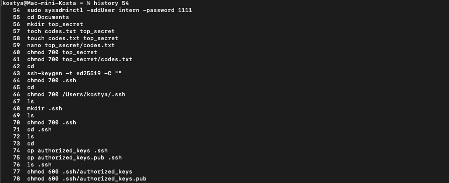
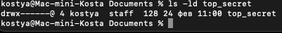
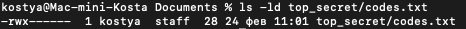
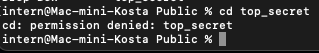
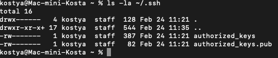

# History

# Вывод команды `ls -ld top_secret`

# Вывод команды `ls -l top_secret/codes.txt`

# Скриншот попытки чтения файла от имени пользователя `intern`

# Вывод команды `ls -la ~/.ssh`

(Публичный ключ сохранен в файле authorized_keys.pub, а приватный в authorized_keys потому что при создании приватного мак создает публичный ключ в файле с таким же названием и окончанием .pub)

