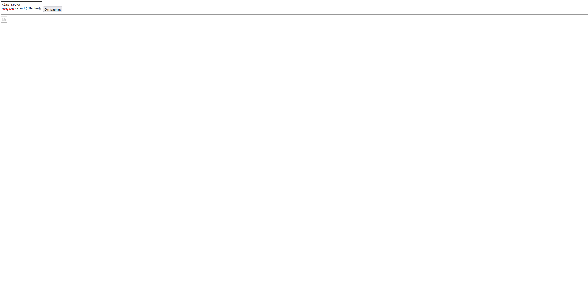
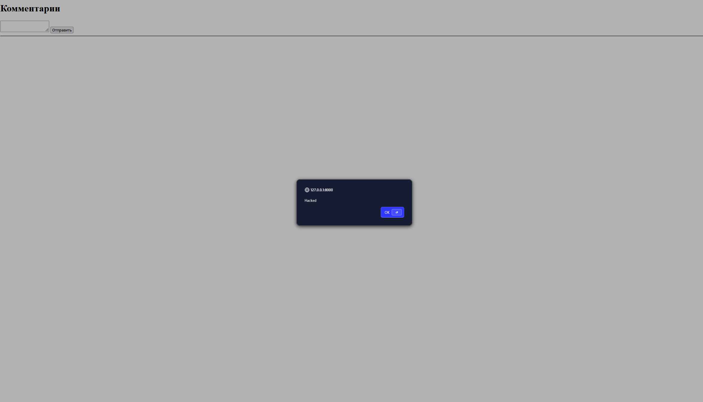
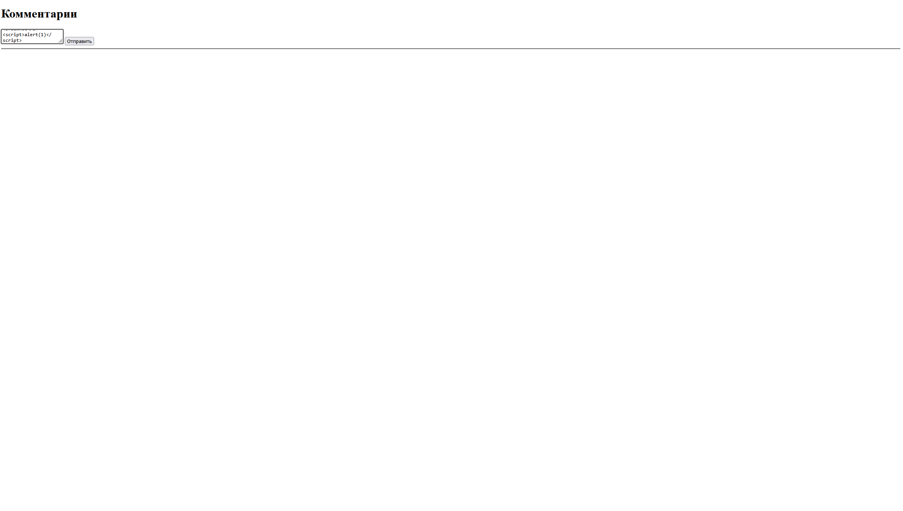
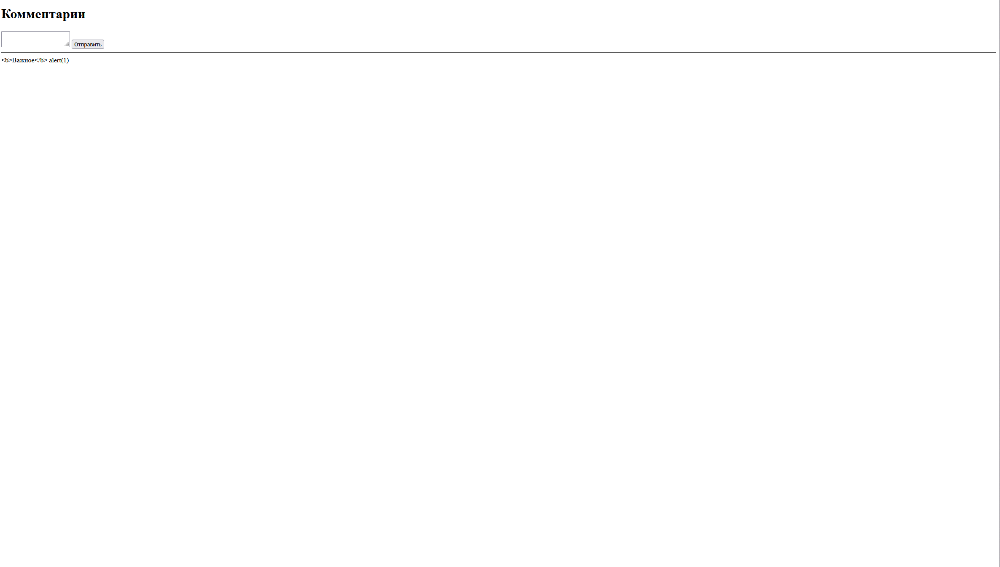
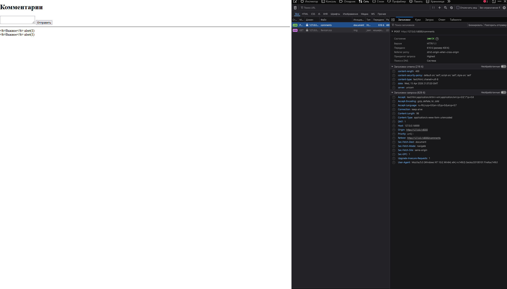
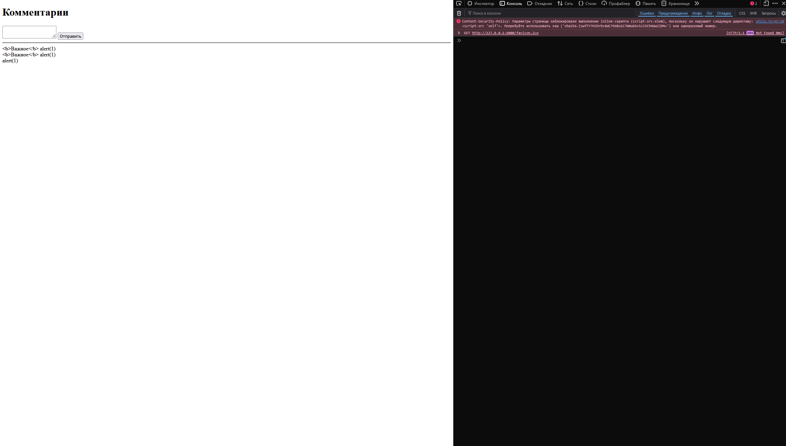

# * Демонстрация XSS










## 2. Санитизация

Использована библиотека bleach.

```python
def sanitize_html(text: str) -> str:
    return bleach.clean(
        text,
        tags=['b', 'i', 'u', 'em', 'strong'],
        attributes={},
        strip=True
    )
```

## 3. CSP

Добавлен заголовок:

Content-Security-Policy:

default-src 'self'; script-src 'self'; style-src 'self'




## 4. Блокировка атаки

Браузер блокирует inline-скрипты.


